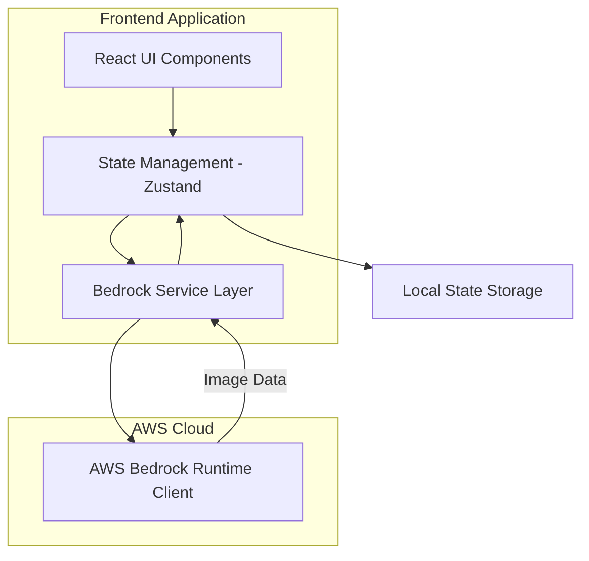
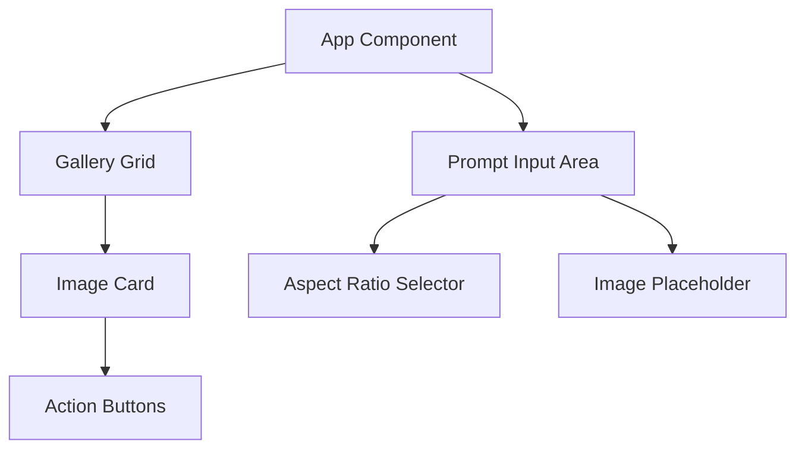

# Design Document: AI Image Generator

## Overview

This application is a React-based web interface for generating and editing images using Amazon Bedrock's Nova 2 Omni model. The architecture follows a clean separation between UI components, state management, and AWS service integration. The application uses TypeScript for type safety, Vite for fast development and building, and ShadCN UI components for a consistent, accessible interface.

The core workflow involves:
1. User enters a text prompt and optionally selects an aspect ratio or edit source image
2. Application sends request to Amazon Bedrock Nova 2 Omni via the Converse API
3. Placeholder is immediately displayed in the gallery grid
4. Generated/edited image replaces the placeholder when ready
5. User can manage images through hover actions (delete, edit)

## Architecture

### High-Level Architecture



### Component Architecture



## Components and Interfaces

### 1. Core Types and Interfaces

```typescript
// Image generation status
type ImageStatus = 'pending' | 'generating' | 'complete' | 'error';

// Aspect ratio options
type AspectRatio = '1:1' | '16:9' | '9:16' | '4:3' | '3:4' | '21:9';

// Image entry in the gallery
interface GeneratedImage {
  id: string;
  url: string; // Base64 data URL or blob URL
  prompt: string;
  status: ImageStatus;
  aspectRatio: AspectRatio;
  width: number;
  height: number;
  createdAt: Date;
  error?: string;
}

// Edit source image
interface EditSource {
  id?: string; // If from gallery
  url: string;
  aspectRatio: AspectRatio;
  width: number;
  height: number;
}

// Generation request
interface GenerationRequest {
  prompt: string;
  aspectRatio?: AspectRatio;
  editSource?: EditSource;
}

// Converse API message content for image generation
interface ConverseMessageContent {
  text?: string;
  image?: {
    format: 'png' | 'jpeg' | 'gif' | 'webp';
    source: {
      bytes: Uint8Array;
    };
  };
}

// Converse API message
interface ConverseMessage {
  role: 'user' | 'assistant';
  content: ConverseMessageContent[];
}
```

### 2. State Management (Zustand Store)

```typescript
interface ImageStore {
  // State
  images: GeneratedImage[];
  selectedAspectRatio: AspectRatio;
  editSource: EditSource | null;
  isGenerating: boolean;
  
  // Actions
  addImage: (image: GeneratedImage) => void;
  updateImage: (id: string, updates: Partial<GeneratedImage>) => void;
  deleteImage: (id: string) => void;
  setAspectRatio: (ratio: AspectRatio) => void;
  setEditSource: (source: EditSource | null) => void;
  clearEditSource: () => void;
}
```

### 3. Bedrock Service Layer

```typescript
class BedrockImageService {
  private client: BedrockRuntimeClient;
  private readonly modelId = 'us.amazon.nova-2-omni-v1:0'; // Nova 2 Omni model ID
  
  constructor(config: { region: string; credentials: AwsCredentialIdentity });
  
  // Generate image from text prompt (with optional input image for editing)
  async generateImage(request: GenerationRequest): Promise<string>;
  
  // Helper: Convert aspect ratio to dimensions (for display purposes)
  private getDimensionsForAspectRatio(ratio: AspectRatio): { width: number; height: number };
  
  // Helper: Encode image to bytes for Converse API
  private async encodeImageToBytes(imageUrl: string | File | Blob): Promise<Uint8Array>;
  
  // Helper: Parse Converse API response to extract generated image
  private parseConverseResponse(response: ConverseCommandOutput): string;
}
```

### 4. React Components

#### App Component
- Root component managing layout
- Provides Bedrock service context
- Handles global error boundaries

#### PromptInputArea Component
```typescript
interface PromptInputAreaProps {
  onSubmit: (prompt: string) => void;
  isGenerating: boolean;
}
```
- Text input for prompts (ShadCN Textarea)
- Aspect ratio selector (ShadCN Select)
- Edit source image placeholder with upload/clear functionality
- Submit button (ShadCN Button)
- Visual state changes based on edit source presence

#### GalleryGrid Component
```typescript
interface GalleryGridProps {
  images: GeneratedImage[];
  onImageDelete: (id: string) => void;
  onImageEdit: (image: GeneratedImage) => void;
}
```
- Responsive CSS Grid layout
- Maps images to ImageCard components
- Handles empty state

#### ImageCard Component
```typescript
interface ImageCardProps {
  image: GeneratedImage;
  onDelete: () => void;
  onEdit: () => void;
}
```
- Displays image or placeholder based on status
- Shows loading indicator for pending/generating states
- Reveals action buttons on hover
- Maintains aspect ratio with CSS

#### AspectRatioSelector Component
```typescript
interface AspectRatioSelectorProps {
  value: AspectRatio;
  onChange: (ratio: AspectRatio) => void;
  disabled: boolean; // Disabled when edit source is present
}
```
- Dropdown selector (ShadCN Select)
- Predefined aspect ratio options
- Disabled state when editing

## Data Models

### Aspect Ratio Dimensions Mapping

```typescript
const ASPECT_RATIO_DIMENSIONS: Record<AspectRatio, { width: number; height: number }> = {
  '1:1': { width: 1024, height: 1024 },
  '16:9': { width: 1344, height: 768 },
  '9:16': { width: 768, height: 1344 },
  '4:3': { width: 1152, height: 896 },
  '3:4': { width: 896, height: 1152 },
  '21:9': { width: 1536, height: 640 },
};
```

### Image Storage

Images are stored in memory as part of the Zustand store. The `GeneratedImage` objects contain:
- Base64 data URLs for immediate display
- Metadata for filtering and sorting
- Status tracking for UI updates

For persistence across sessions, the store can be synced to localStorage using Zustand middleware.

## Correctness Properties

*A property is a characteristic or behavior that should hold true across all valid executions of a system—essentially, a formal statement about what the system should do. Properties serve as the bridge between human-readable specifications and machine-verifiable correctness guarantees.*


### Property Reflection

After analyzing all acceptance criteria, several redundancies were identified:
- Requirements 6.4 and 6.5 both test aspect ratio preservation for uploaded images - consolidated into Property 11
- Requirements 3.5 and 8.5 both test placeholder aspect ratios - consolidated into Property 5
- Requirements 4.1 and 5.1 both test hover button revelation - consolidated into Property 8
- Requirements 1.3 and 3.5 overlap on placeholder behavior - consolidated into Property 5

### Correctness Properties

Property 1: Non-empty prompt validation
*For any* string input, if it is empty or contains only whitespace, the system should reject it and prevent API calls
**Validates: Requirements 1.2**

Property 2: Placeholder creation with correct aspect ratio
*For any* generation request, when generation begins, a placeholder should be added to the gallery with the aspect ratio matching the request
**Validates: Requirements 1.3, 3.5**

Property 3: Successful generation replaces placeholder
*For any* successful image generation, the placeholder should be replaced with the generated image data
**Validates: Requirements 1.4**

Property 4: Failed generation shows error and removes placeholder
*For any* failed image generation, an error message should be displayed and the placeholder should be removed from the gallery
**Validates: Requirements 1.5**

Property 5: Aspect ratio selection affects generation requests
*For any* selected aspect ratio, when generating an image from scratch, the API request dimensions should match the selected ratio
**Validates: Requirements 2.2, 2.3**

Property 6: Aspect ratio persistence
*For any* aspect ratio selection, the selection should remain unchanged until explicitly modified by the user
**Validates: Requirements 2.5**

Property 7: New images appear first in gallery
*For any* new image added to the gallery, it should appear at the beginning of the image list
**Validates: Requirements 3.3**

Property 8: Hover reveals action buttons
*For any* image in the gallery, hovering over it should reveal both delete and edit action buttons
**Validates: Requirements 4.1, 5.1**

Property 9: Delete removes image from gallery
*For any* image in the gallery, clicking the delete button should remove that image from the display
**Validates: Requirements 4.2**

Property 10: Mouse leave hides action buttons
*For any* image with visible action buttons, moving the cursor away should hide the buttons
**Validates: Requirements 4.4**

Property 11: Edit icon sets edit source
*For any* image in the gallery, clicking the edit icon should set that image as the edit source in the prompt input area
**Validates: Requirements 5.2**

Property 12: Edit source displays thumbnail
*For any* edit source (uploaded or selected from gallery), the prompt input area should display a thumbnail of that image
**Validates: Requirements 5.3, 6.3**

Property 13: Edit requests preserve aspect ratio
*For any* edit request with an edit source, the API request should use the original image's aspect ratio, not the selected aspect ratio
**Validates: Requirements 5.4, 6.4, 6.5**

Property 14: Edit completion adds new gallery entry
*For any* successful edit operation, a new image should be added to the gallery (not replacing the original)
**Validates: Requirements 5.5**

Property 15: File upload validation
*For any* uploaded file, if it is not a supported image format (PNG, JPEG), the system should reject it with an error message
**Validates: Requirements 6.2**

Property 16: Edit source removal control visibility
*For any* state where an edit source is present, a control to remove the edit source should be visible
**Validates: Requirements 7.1**

Property 17: Clear edit source resets to generation mode
*For any* edit source, when cleared, the prompt input area should return to empty state and subsequent submissions should use TEXT_IMAGE task type
**Validates: Requirements 7.2, 7.4**

Property 18: Clearing edit source restores aspect ratio control
*For any* edit source, when cleared, the aspect ratio selector should control subsequent generation requests
**Validates: Requirements 7.3**

Property 19: Generation start shows loading indicator
*For any* generation request, while in progress, a loading indicator should be visible in both the placeholder and prompt input area
**Validates: Requirements 8.1, 8.2**

Property 20: Concurrent generations have separate placeholders
*For any* set of concurrent generation requests, each should have its own distinct placeholder in the gallery
**Validates: Requirements 8.4**

Property 21: API request format correctness
*For any* generation or edit request, the API payload should conform to the Bedrock InvokeModel request structure with correct taskType and parameters
**Validates: Requirements 10.1, 10.2**

Property 22: API response parsing
*For any* successful API response, the system should correctly extract the Base64 image data from the response structure
**Validates: Requirements 10.4**

Property 23: API error handling
*For any* API error response, the system should extract error details and display a user-friendly error message
**Validates: Requirements 10.5**

## Error Handling

### Error Categories

1. **Validation Errors**
   - Empty or whitespace-only prompts
   - Invalid file formats for uploads
   - Unsupported image dimensions
   - Handle at UI layer before API calls

2. **API Errors**
   - Authentication/authorization failures (403)
   - Rate limiting (429)
   - Model errors (400)
   - Service unavailable (503)
   - Timeout errors
   - Parse and display user-friendly messages

3. **Network Errors**
   - Connection failures
   - Timeout during generation
   - Retry with exponential backoff

4. **Client Errors**
   - Image encoding failures
   - Invalid Base64 data
   - Memory issues with large images
   - Graceful degradation

### Error Handling Strategy

```typescript
interface ErrorHandler {
  // Categorize error and return user-friendly message
  handleError(error: unknown): {
    message: string;
    category: 'validation' | 'api' | 'network' | 'client';
    retryable: boolean;
  };
}
```

- Display errors using ShadCN Toast component
- Provide retry option for retryable errors
- Log detailed errors to console for debugging
- Remove placeholders on non-retryable errors
- Maintain application state consistency

## Testing Strategy

### Unit Testing

The application will use **Vitest** as the testing framework, which integrates seamlessly with Vite and provides excellent TypeScript support.

Unit tests will cover:

1. **Component Rendering**
   - PromptInputArea renders with correct initial state
   - GalleryGrid renders empty state correctly
   - ImageCard displays loading state appropriately
   - AspectRatioSelector shows all options

2. **State Management**
   - Zustand store actions update state correctly
   - State persistence to localStorage works
   - State hydration on app load

3. **Service Layer**
   - BedrockImageService constructs correct API payloads
   - Dimension calculation for aspect ratios
   - Base64 encoding/decoding utilities
   - Response parsing logic

4. **Error Handling**
   - ErrorHandler categorizes errors correctly
   - User-friendly messages for different error types
   - Retry logic for network errors

5. **Edge Cases**
   - Empty prompt submission blocked
   - Invalid file upload rejected
   - Clearing edit source resets state
   - Default aspect ratio used when none selected

### Property-Based Testing

The application will use **fast-check** as the property-based testing library for JavaScript/TypeScript.

Configuration:
- Each property test should run a minimum of 100 iterations
- Use appropriate generators for different data types
- Seed tests for reproducibility during debugging

Property tests will verify the correctness properties defined above. Each test must:
- Be tagged with a comment referencing the design document property
- Use the format: `// Feature: ai-image-generator, Property {number}: {property_text}`
- Generate appropriate random inputs for the property being tested
- Assert the property holds across all generated inputs

Example property test structure:
```typescript
import fc from 'fast-check';

// Feature: ai-image-generator, Property 1: Non-empty prompt validation
test('should reject empty or whitespace-only prompts', () => {
  fc.assert(
    fc.property(
      fc.string().filter(s => s.trim() === ''), // Generate whitespace strings
      (prompt) => {
        const result = validatePrompt(prompt);
        expect(result.isValid).toBe(false);
      }
    ),
    { numRuns: 100 }
  );
});
```

Key property tests:
- Prompt validation rejects all whitespace strings (Property 1)
- Aspect ratio dimensions match selected ratio (Property 5)
- New images always appear first in list (Property 7)
- Edit requests preserve original aspect ratios (Property 13)
- API payloads conform to Bedrock format (Property 21)
- Response parsing extracts image data correctly (Property 22)

### Integration Testing

Integration tests will use **React Testing Library** to test component interactions:

1. **End-to-End User Flows**
   - Generate image from scratch flow
   - Edit existing image flow
   - Upload and edit custom image flow
   - Delete image flow

2. **State Synchronization**
   - UI updates reflect store changes
   - Store updates trigger re-renders
   - Multiple components stay in sync

3. **API Integration** (with mocked Bedrock client)
   - Successful generation updates gallery
   - Failed generation shows error
   - Concurrent requests handled correctly

### Testing Best Practices

- Mock AWS SDK calls to avoid actual API requests
- Use MSW (Mock Service Worker) for network mocking if needed
- Test accessibility with jest-axe
- Ensure all ShadCN components are keyboard navigable
- Test responsive behavior at different viewport sizes
- Verify loading states and transitions
- Test error recovery flows

## Implementation Notes

### AWS SDK Configuration

```typescript
// Configure Bedrock Runtime Client for Converse API
import { BedrockRuntimeClient, ConverseCommand } from '@aws-sdk/client-bedrock-runtime';
import { fromCognitoIdentityPool } from '@aws-sdk/credential-providers';

const client = new BedrockRuntimeClient({
  region: 'us-east-1', // or user-selected region
  credentials: fromCognitoIdentityPool({
    clientConfig: { region: 'us-east-1' },
    identityPoolId: 'IDENTITY_POOL_ID',
  }),
});

// Example: Generate image using Converse API
const command = new ConverseCommand({
  modelId: 'us.amazon.nova-2-omni-v1:0',
  messages: [
    {
      role: 'user',
      content: [
        { text: 'Generate an image of a sunset over mountains' }
      ]
    }
  ]
});

const response = await client.send(command);
// Extract generated image from response
```

### Performance Considerations

1. **Image Optimization**
   - Use object URLs for large images instead of Base64 data URLs
   - Revoke object URLs when images are deleted
   - Implement lazy loading for gallery images

2. **State Management**
   - Limit number of images stored in memory
   - Implement pagination or virtual scrolling for large galleries
   - Debounce aspect ratio changes

3. **API Calls**
   - Implement request cancellation for abandoned generations
   - Queue concurrent requests to avoid rate limiting
   - Cache generated images by prompt hash (optional)

### Accessibility

- All interactive elements keyboard accessible
- Proper ARIA labels for screen readers
- Focus management for modal dialogs
- Alt text for generated images using prompts
- High contrast mode support
- Loading states announced to screen readers

### Security

- Validate and sanitize all user inputs
- Use AWS Cognito for authentication
- Implement proper CORS configuration
- Never expose AWS credentials in client code
- Use IAM roles with least privilege
- Validate file uploads on client and server

## Technology Stack Summary

- **Framework**: React 18+ with TypeScript
- **Build Tool**: Vite
- **UI Components**: ShadCN UI (Radix UI + Tailwind CSS)
- **State Management**: Zustand
- **AWS SDK**: @aws-sdk/client-bedrock-runtime
- **Testing**: Vitest, React Testing Library, fast-check
- **Styling**: Tailwind CSS
- **Type Checking**: TypeScript 5+
