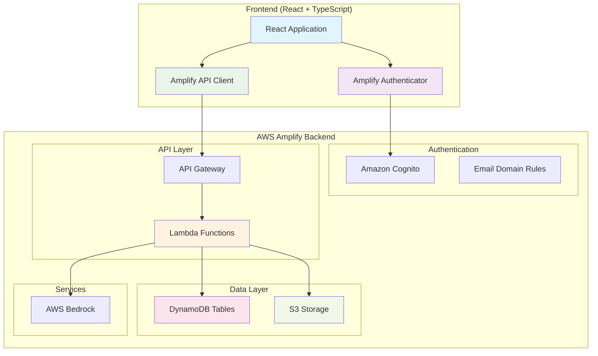
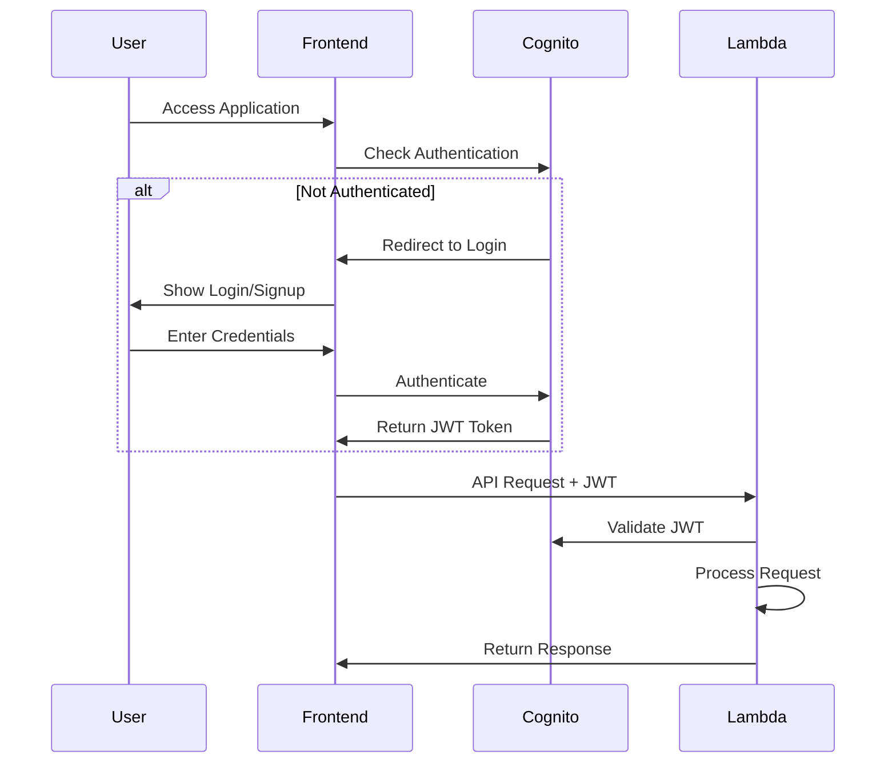

# Design Document: AWS Amplify Integration

## Overview

This design transforms the existing client-side image generation application into a full-stack, multi-user application using AWS Amplify Gen 2. The solution provides secure authentication, API proxying through Lambda functions, cloud data storage, and user isolation across all features.

The architecture follows AWS Amplify Gen 2's code-first approach, using TypeScript to define backend infrastructure including authentication, data models, Lambda functions, and S3 storage. The frontend will be updated to integrate with Amplify's authentication and API services while maintaining the existing user experience.

## Architecture

### High-Level Architecture



### Authentication Flow



## Components and Interfaces

### Frontend Components

#### Authentication Integration
- **AmplifyAuthenticator**: Wraps the entire application to enforce authentication
- **AuthProvider**: Provides authentication context throughout the app
- **ProtectedRoute**: Ensures all routes require authentication

#### API Integration
- **AmplifyAPIClient**: Replaces direct Bedrock calls with Lambda API calls
- **ImageService**: Updated to use Amplify Storage for S3 operations
- **PersonaService**: Updated to use Amplify Data for database operations

#### Updated Existing Components
- **BedrockImageService**: Modified to call Lambda APIs instead of direct Bedrock
- **PersonaSelector**: Enhanced to save/load personas from cloud storage
- **GalleryGrid**: Updated to load images from S3 with proper authentication

### Backend Components

#### Authentication Resource (`amplify/auth/resource.ts`)
```typescript
export const auth = defineAuth({
  loginWith: {
    email: {
      verificationEmailStyle: "code",
      verificationEmailSubject: "Welcome to Image Generator",
    },
  },
  userAttributes: {
    email: {
      required: true,
    },
  },
  accountRecovery: "email",
});
```

#### Data Resource (`amplify/data/resource.ts`)
```typescript
const schema = a.schema({
  ImageMetadata: a.model({
    id: a.id().required(),
    userId: a.string().required(),
    prompt: a.string().required(),
    enhancedPrompt: a.string(),
    aspectRatio: a.string(),
    s3Key: a.string().required(),
    s3Url: a.string(),
    createdAt: a.datetime().required(),
    updatedAt: a.datetime().required(),
  }).authorization(allow => [allow.owner()]),
  
  PersonaData: a.model({
    id: a.id().required(),
    userId: a.string().required(),
    name: a.string().required(),
    description: a.string(),
    icon: a.string(),
    promptTemplate: a.string().required(),
    isDefault: a.boolean().default(false),
    createdAt: a.datetime().required(),
    updatedAt: a.datetime().required(),
  }).authorization(allow => [allow.owner()]),
});
```

#### Storage Resource (`amplify/storage/resource.ts`)
```typescript
export const storage = defineStorage({
  name: 'imageGeneratorStorage',
  access: (allow) => ({
    'images/{entity_id}/*': [
      allow.entity('identity').to(['read', 'write', 'delete'])
    ],
    'public/*': [
      allow.authenticated.to(['read']),
      allow.guest.to(['read'])
    ]
  })
});
```

#### Lambda Functions (`amplify/functions/`)

**Image Generation Function** (`amplify/functions/generate-image/resource.ts`)
```typescript
export const generateImage = defineFunction({
  name: 'generateImage',
  entry: './handler.ts',
  environment: {
    BEDROCK_REGION: 'us-east-1',
  },
  runtime: 'nodejs18.x',
  timeout: '5 minutes',
});
```

**Prompt Enhancement Function** (`amplify/functions/enhance-prompt/resource.ts`)
```typescript
export const enhancePrompt = defineFunction({
  name: 'enhancePrompt',
  entry: './handler.ts',
  environment: {
    BEDROCK_REGION: 'us-east-1',
  },
  runtime: 'nodejs18.x',
  timeout: '2 minutes',
});
```

## Data Models

### ImageMetadata Model
```typescript
interface ImageMetadata {
  id: string;                    // Unique identifier
  userId: string;                // Owner user ID (auto-populated by Amplify)
  prompt: string;                // Original user prompt
  enhancedPrompt?: string;       // AI-enhanced prompt (if used)
  aspectRatio: string;           // Image aspect ratio
  s3Key: string;                 // S3 object key
  s3Url?: string;               // Pre-signed URL for access
  createdAt: string;            // ISO timestamp
  updatedAt: string;            // ISO timestamp
}
```

### PersonaData Model
```typescript
interface PersonaData {
  id: string;                    // Unique identifier
  userId: string;                // Owner user ID (auto-populated by Amplify)
  name: string;                  // Persona display name
  description?: string;          // Optional description
  icon?: string;                 // Icon identifier
  promptTemplate: string;        // Template with placeholders
  isDefault: boolean;           // Whether this is user's default persona
  createdAt: string;            // ISO timestamp
  updatedAt: string;            // ISO timestamp
}
```

### User Authentication Model
```typescript
interface AmplifyUser {
  userId: string;                // Cognito user ID
  username: string;              // Email address
  email: string;                 // Verified email
  emailVerified: boolean;        // Email verification status
  signInDetails: {
    loginId: string;             // Login identifier
  };
}
```

## Correctness Properties

*A property is a characteristic or behavior that should hold true across all valid executions of a system—essentially, a formal statement about what the system should do. Properties serve as the bridge between human-readable specifications and machine-verifiable correctness guarantees.*

Based on the prework analysis, I've identified properties that can be tested across multiple inputs and examples that test specific scenarios. Here are the key correctness properties:

### Authentication Properties

**Property 1: Email domain validation**
*For any* email address that does not match configured allowed domains, the registration system should reject the account creation request
**Validates: Requirements 1.2**

**Property 2: Valid domain acceptance**
*For any* email address that matches configured allowed domains, the registration system should accept the account creation request
**Validates: Requirements 1.3**

**Property 3: Domain configuration enforcement**
*For any* configured set of allowed domains, the authentication system should enforce exactly those domains and reject all others
**Validates: Requirements 1.5, 7.1**

**Property 4: Multi-domain support**
*For any* configuration with multiple allowed domains, the system should accept email addresses from any of the configured domains
**Validates: Requirements 7.3**

### API Security Properties

**Property 5: Authentication context propagation**
*For any* API request from an authenticated user, the Lambda functions should receive and validate the user's authentication context
**Validates: Requirements 2.1, 2.2**

**Property 6: Token validation consistency**
*For any* authentication token state (valid, invalid, expired), the Lambda API should handle it appropriately - accepting valid tokens and rejecting invalid ones
**Validates: Requirements 2.2**

### Data Isolation Properties

**Property 7: User-scoped metadata storage**
*For any* image generation request, the stored metadata should be associated with the requesting user's ID and only accessible by that user
**Validates: Requirements 3.1, 3.2, 3.5**

**Property 8: Metadata completeness**
*For any* stored image metadata record, it should contain all required fields: generation parameters, timestamps, and file references
**Validates: Requirements 3.3**

**Property 9: Metadata deletion consistency**
*For any* image deletion request, the corresponding metadata should be completely removed from the database
**Validates: Requirements 3.4**

### Storage Properties

**Property 10: User-segmented S3 storage**
*For any* generated image, it should be stored in S3 under a folder structure that includes the user's ID
**Validates: Requirements 4.1, 4.2**

**Property 11: Secure URL generation**
*For any* image access request, the system should generate time-limited, signed URLs that expire after a reasonable period
**Validates: Requirements 4.3**

**Property 12: S3 deletion consistency**
*For any* image deletion request, the corresponding S3 object should be completely removed and no longer accessible
**Validates: Requirements 4.4**

**Property 13: S3 access control isolation**
*For any* user attempting to access images, they should only be able to access images they created, not images from other users
**Validates: Requirements 4.5**

### Persona Management Properties

**Property 14: User-scoped persona storage**
*For any* persona creation request, the persona should be stored with the user's ID and only accessible by that user
**Validates: Requirements 5.1, 5.5**

**Property 15: Persona update consistency**
*For any* persona modification, the changes should be persisted to the database and reflected in subsequent retrievals
**Validates: Requirements 5.3**

**Property 16: Persona deletion consistency**
*For any* persona deletion request, the persona should be completely removed and no longer accessible
**Validates: Requirements 5.4**

### Configuration Properties

**Property 17: Configuration change propagation**
*For any* change to domain restrictions configuration, the new restrictions should be enforced for all subsequent registration attempts
**Validates: Requirements 7.2**

<function_calls>
<invoke name="prework">
<parameter name="featureName">amplify-integration

## Error Handling

### Authentication Errors
- **Invalid Email Domain**: Clear error message indicating domain restrictions
- **Email Verification Failed**: Resend verification option with rate limiting
- **Token Expiration**: Automatic token refresh or redirect to login
- **Account Locked**: Clear messaging with recovery options

### API Errors
- **Bedrock Service Unavailable**: Graceful degradation with retry logic
- **Lambda Timeout**: User-friendly timeout messages with retry options
- **Rate Limiting**: Clear messaging about usage limits and retry timing
- **Invalid Request Parameters**: Detailed validation error messages

### Data Errors
- **Database Connection Issues**: Retry logic with exponential backoff
- **S3 Upload Failures**: Retry mechanism with progress indication
- **Data Corruption**: Validation checks with recovery procedures
- **Quota Exceeded**: Clear messaging about storage limits

### Network Errors
- **Offline Mode**: Cache recent data and queue operations
- **Slow Connections**: Progressive loading and timeout handling
- **Connection Drops**: Automatic reconnection with state preservation

## Testing Strategy

### Dual Testing Approach
This feature requires both unit tests and property-based tests to ensure comprehensive coverage:

- **Unit Tests**: Verify specific examples, edge cases, and error conditions
- **Property Tests**: Verify universal properties across all inputs using randomized testing
- **Integration Tests**: Verify end-to-end flows across multiple components

### Property-Based Testing Configuration
- **Testing Library**: Use `fast-check` for TypeScript property-based testing
- **Test Iterations**: Minimum 100 iterations per property test
- **Test Tagging**: Each property test must reference its design document property
- **Tag Format**: `**Feature: amplify-integration, Property {number}: {property_text}**`

### Unit Testing Focus Areas
- Authentication flow edge cases (expired tokens, malformed requests)
- API error handling scenarios (network failures, service unavailable)
- Data validation edge cases (malformed data, missing fields)
- S3 operations (upload failures, access denied scenarios)
- Configuration management (invalid configurations, missing settings)

### Integration Testing Scenarios
- Complete user registration and login flow
- End-to-end image generation with storage
- Multi-user data isolation verification
- Persona management across user sessions
- Error recovery and retry mechanisms

### Testing Environment Setup
- **Local Development**: Use Amplify sandbox for isolated testing
- **CI/CD Pipeline**: Automated testing on pull requests
- **Staging Environment**: Full integration testing before production
- **Production Monitoring**: Continuous monitoring with alerting

### Performance Testing
- **Load Testing**: Simulate multiple concurrent users
- **Stress Testing**: Test system limits and graceful degradation
- **Latency Testing**: Measure API response times
- **Storage Testing**: Test S3 upload/download performance

### Security Testing
- **Authentication Testing**: Verify token validation and expiration
- **Authorization Testing**: Verify user isolation and access controls
- **Input Validation**: Test against injection attacks and malformed data
- **Data Encryption**: Verify data encryption at rest and in transit