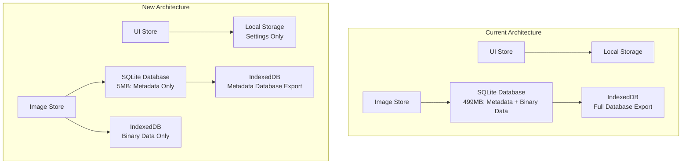

# Data Storage Optimization Design

## Overview

This design optimizes the current data storage architecture by separating concerns across three distinct storage mechanisms. The current approach stores everything in a single SQLite database that exports 499MB to IndexedDB on every change, causing 340ms delays. The new architecture will:

1. **Local Storage**: App settings (uiStore.ts) - already implemented and working well
2. **SQLite Database**: Image metadata only - structured queries without binary data overhead  
3. **IndexedDB**: Image byte data only - optimized for large binary storage

This separation reduces the SQLite database size dramatically (from 499MB to ~5-10MB for metadata), eliminates unnecessary exports of binary data, and provides optimal storage mechanisms for each data type.

## Architecture

### Current Architecture Issues
- Single SQLite database contains both metadata (~5MB) and binary image data (~494MB)
- Every metadata change triggers full database export (499MB) to IndexedDB
- Binary data is unnecessarily processed through SQL operations
- No separation of concerns between different data types

### New Architecture Benefits
- **Local Storage**: Instant synchronous access for UI settings
- **SQLite**: Fast queries on small metadata-only database (~5MB)
- **IndexedDB**: Direct binary storage without SQL overhead
- **Debounced Exports**: Only metadata database needs debouncing (5MB vs 499MB)



## Components and Interfaces

### 1. Enhanced SQLite Service
**Purpose**: Handle image metadata with optimized schema
**Changes**: Remove binary data storage, optimize for metadata-only operations

```typescript
interface MetadataOnlySQLiteService {
    // Metadata operations (no binary data)
    addImageMetadata(metadata: ImageMetadata): Promise<void>;
    updateImageMetadata(id: string, updates: Partial<ImageMetadata>): Promise<void>;
    deleteImageMetadata(id: string): Promise<void>;
    getImageMetadataPaginated(offset: number, limit: number): Promise<ImageMetadata[]>;
    
    // Database management (much smaller exports)
    exportMetadataDatabase(): Uint8Array; // ~5MB instead of 499MB
    importMetadataDatabase(data: Uint8Array): Promise<void>;
}
```

### 2. New IndexedDB Binary Storage Service
**Purpose**: Handle image byte data with direct binary operations
**Benefits**: No SQL overhead, optimized for large binary data

```typescript
interface BinaryStorageService {
    // Binary data operations
    storeImageData(id: string, dataUrl: string): Promise<void>;
    getImageData(id: string): Promise<string | null>;
    deleteImageData(id: string): Promise<void>;
    deleteMultipleImageData(ids: string[]): Promise<void>;
    
    // Storage management
    getStorageUsage(): Promise<{ used: number; quota: number }>;
    cleanupOldestImages(count: number): Promise<string[]>;
}
```

### 3. Updated Image Store
**Purpose**: Coordinate between metadata and binary storage
**Changes**: Route operations to appropriate storage mechanisms

```typescript
interface OptimizedImageStore {
    // Coordinated operations
    addImage(image: GeneratedImage): Promise<void>; // Split metadata/binary
    updateImage(id: string, updates: Partial<GeneratedImage>): Promise<void>;
    deleteImage(id: string): Promise<void>; // Clean both storages
    
    // Optimized loading
    loadImageMetadata(): Promise<void>; // Fast metadata-only load
    loadImageData(id: string): Promise<string | null>; // On-demand binary load
}
```

## Data Models

### Metadata Storage (SQLite)
```sql
-- Optimized metadata-only schema
CREATE TABLE image_metadata (
    id TEXT PRIMARY KEY,
    prompt TEXT NOT NULL,
    status TEXT NOT NULL,
    aspectRatio TEXT NOT NULL,
    width INTEGER NOT NULL,
    height INTEGER NOT NULL,
    createdAt INTEGER NOT NULL,
    error TEXT,
    converseParams TEXT,
    -- New fields for binary storage coordination
    hasBinaryData BOOLEAN DEFAULT FALSE,
    binaryDataSize INTEGER DEFAULT 0
);

CREATE INDEX idx_metadata_createdAt ON image_metadata(createdAt DESC);
CREATE INDEX idx_metadata_status ON image_metadata(status);
```

### Binary Storage (IndexedDB)
```typescript
// IndexedDB object store schema
interface BinaryDataStore {
    keyPath: 'id';
    data: {
        id: string;
        dataUrl: string; // Base64 image data
        size: number;
        createdAt: number;
        lastAccessed: number; // For cleanup strategies
    };
}
```

### Settings Storage (Local Storage) - No Changes
Current implementation in uiStore.ts is already optimal for settings data.

## Correctness Properties

*A property is a characteristic or behavior that should hold true across all valid executions of a system-essentially, a formal statement about what the system should do. Properties serve as the bridge between human-readable specifications and machine-verifiable correctness guarantees.*

Based on the prework analysis, I need to perform property reflection to eliminate redundancy:

**Property Reflection:**
- Properties 1.1 and 1.4 both test timing performance - can be combined into a comprehensive performance property
- Properties 2.1 and 2.2 both test settings storage timing - can be combined  
- Properties 3.1 and 4.1 both test storage mechanism routing - can be combined with 5.1 and 5.2
- Properties 4.4 and 4.5 both test cleanup behavior - can be combined
- Properties 1.5, 2.3, 2.4, 3.4, and 4.3 all test error handling - can be consolidated

**Property 1: UI Performance Under Load**
*For any* image addition or metadata update operation, the UI should remain responsive with updates completing within 50ms and initial data loading within 2 seconds
**Validates: Requirements 1.1, 1.4**

**Property 2: Asynchronous Persistence**
*For any* data persistence operation, the system should not block the UI thread and should batch rapid operations to prevent performance degradation
**Validates: Requirements 1.2, 1.3, 3.5**

**Property 3: Storage Mechanism Routing**
*For any* data persistence operation, app settings should route to localStorage, image metadata to SQLite, and binary data to IndexedDB
**Validates: Requirements 2.1, 3.1, 4.1, 5.1, 5.2**

**Property 4: Settings Performance and Recovery**
*For any* settings operation, persistence should complete within 100ms and corrupted data should gracefully fall back to defaults
**Validates: Requirements 2.2, 2.3, 2.4**

**Property 5: Metadata Query Performance**
*For any* metadata query operation on datasets up to 10,000 records, pagination and filtering should complete within 100ms
**Validates: Requirements 3.2, 3.3**

**Property 6: On-Demand Binary Loading**
*For any* image data request, the system should load binary data only when requested, not during initialization
**Validates: Requirements 4.2**

**Property 7: Comprehensive Error Handling**
*For any* storage operation failure, the system should maintain data consistency, provide error feedback, attempt recovery, and isolate failures between storage mechanisms
**Validates: Requirements 1.5, 2.4, 3.4, 4.3, 5.3**

**Property 8: Storage Cleanup**
*For any* deletion or quota exceeded scenario, the system should clean up both metadata and binary data and implement cleanup strategies
**Validates: Requirements 4.4, 4.5**

**Property 9: Debugging and Observability**
*For any* storage operation, the system should provide clear, separate logging for each storage mechanism to enable effective debugging
**Validates: Requirements 5.5**

## Error Handling

### Storage Failure Isolation
- **Local Storage Failure**: Fall back to in-memory settings, warn user about persistence loss
- **SQLite Failure**: Attempt database recovery, fall back to in-memory metadata with periodic retry
- **IndexedDB Failure**: Graceful degradation to placeholder images, implement retry with exponential backoff

### Data Consistency Strategies
- **Atomic Operations**: Ensure metadata and binary data operations are coordinated
- **Rollback Mechanisms**: If binary storage fails, rollback metadata changes
- **Consistency Checks**: Periodic validation that metadata references have corresponding binary data

## Testing Strategy

### Dual Testing Approach
The testing strategy combines unit testing and property-based testing to ensure comprehensive coverage:

**Unit Testing**:
- Specific examples of storage operations
- Integration points between storage mechanisms  
- Error scenarios and edge cases
- Migration workflows

**Property-Based Testing**:
- Universal properties using fast-check library (already available)
- Each property-based test will run a minimum of 100 iterations
- Tests will be tagged with comments referencing design document properties
- Format: `**Feature: data-storage-optimization, Property {number}: {property_text}**`

**Property-Based Testing Library**: fast-check (already installed)
**Test Configuration**: Minimum 100 iterations per property test
**Test Tagging**: Each property test must reference its corresponding design property

### Performance Testing
- **Load Testing**: Test with datasets up to 10,000 records
- **Timing Validation**: Verify performance requirements (50ms UI, 100ms queries, 2s startup)
- **Memory Usage**: Monitor memory consumption during large operations
- **Storage Quota**: Test behavior near browser storage limits

## Implementation Phases

### Phase 1: Binary Storage Service
1. Create IndexedDB binary storage service
2. Implement basic CRUD operations for binary data
3. Add storage quota management and cleanup strategies

### Phase 2: SQLite Optimization  
1. Remove binary data from SQLite schema
2. Optimize metadata-only operations
3. Reduce database export size from 499MB to ~5MB

### Phase 3: Image Store Coordination
1. Update image store to coordinate between storage mechanisms
2. Implement atomic operations for metadata/binary consistency
3. Add error handling and rollback mechanisms

### Phase 4: Performance Optimization
1. Implement debounced operations for metadata exports
2. Add caching layers for frequently accessed data
3. Optimize startup performance and lazy loading