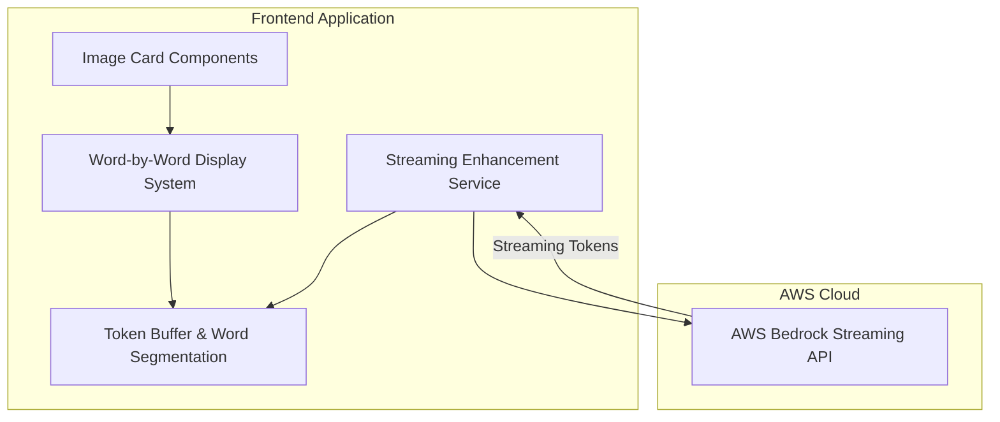
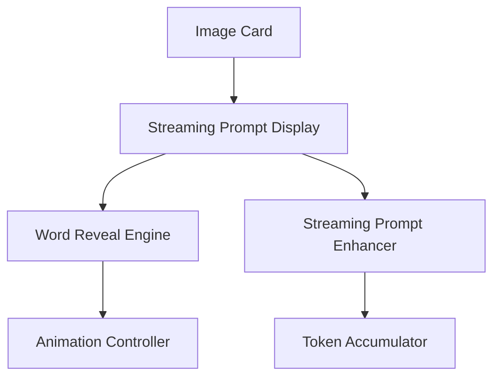

# Design Document: Streaming Prompt Enhancement

## Overview

This enhancement transforms the AI image generator's prompt display system from instant text revelation to a streaming, word-by-word presentation that feels natural and human-like. The system has two main components: a streaming prompt enhancement service that uses Amazon Bedrock's Converse streaming API, and a word-by-word display system that reveals all prompts (enhanced or original) with organic timing and fade-in animations.

The core workflow involves:
1. User submits a prompt with or without a persona selected
2. If persona is selected, system streams enhanced prompt tokens from Bedrock
3. Tokens are accumulated into complete words
4. All prompts (enhanced or original) are displayed word-by-word on image cards
5. Each word appears with natural delays and fade-in animations
6. Visual feedback indicates active display and completion

## Architecture

### High-Level Architecture



### Component Architecture



## Components and Interfaces

### 1. Core Types and Interfaces

```typescript
// Word display state
type WordDisplayStatus = 'idle' | 'streaming' | 'revealing' | 'complete' | 'error';

// Individual word with timing information
interface DisplayWord {
  text: string;
  delay: number; // Delay before showing this word (ms)
  fadeInDuration: number; // Fade-in animation duration (ms)
  isVisible: boolean;
  hasAnimated: boolean;
}

// Word-by-word display configuration
interface WordDisplayConfig {
  baseDelay: { min: number; max: number }; // 50-200ms
  longWordThreshold: number; // 8 characters
  longWordDelayMultiplier: number; // 1.5x
  punctuationDelays: Record<string, number>; // Additional delays for punctuation
  fadeInDuration: { min: number; max: number }; // 100-300ms
}

// Streaming enhancement state
interface StreamingEnhancementState {
  status: 'idle' | 'streaming' | 'complete' | 'error';
  tokens: string[];
  accumulatedText: string;
  error?: string;
}

// Token from streaming API
interface StreamingToken {
  text: string;
  isComplete: boolean; // Whether this completes a word
}

// Enhanced prompt enhancement service interface
interface StreamingPromptEnhancer {
  enhancePromptStreaming(
    originalPrompt: string, 
    enhancementType: PromptEnhancement,
    onToken: (token: StreamingToken) => void,
    onComplete: (finalText: string) => void,
    onError: (error: string) => void
  ): Promise<void>;
  
  cancelStreaming(): void;
}

// Word-by-word display service interface
interface WordByWordDisplay {
  startDisplay(
    text: string,
    config: WordDisplayConfig,
    onWordReveal: (word: DisplayWord, index: number) => void,
    onComplete: () => void
  ): void;
  
  cancelDisplay(): void;
  showInstantly(text: string): void;
  cleanup(): void;
}
```

### 2. Streaming Prompt Enhancement Service

```typescript
class StreamingPromptEnhancementService {
  private client: BedrockRuntimeClient;
  private activeStream: AbortController | null = null;
  
  constructor(client: BedrockRuntimeClient);
  
  // Enhanced version of existing enhancePrompt method with streaming
  async enhancePromptStreaming(
    originalPrompt: string,
    enhancementType: PromptEnhancement,
    onToken: (token: StreamingToken) => void,
    onComplete: (finalText: string) => void,
    onError: (error: string) => void
  ): Promise<void>;
  
  // Cancel active streaming
  cancelStreaming(): void;
  
  // Helper: Accumulate tokens into words
  private accumulateTokensIntoWords(tokens: string[]): string[];
  
  // Helper: Detect word boundaries in token stream
  private isWordBoundary(token: string): boolean;
}
```

### 3. Word-by-Word Display Engine

```typescript
class WordByWordDisplayEngine {
  private activeTimers: Set<NodeJS.Timeout> = new Set();
  private isActive: boolean = false;
  private config: WordDisplayConfig;
  
  constructor(config: WordDisplayConfig);
  
  // Start word-by-word display
  startDisplay(
    text: string,
    onWordReveal: (word: DisplayWord, index: number) => void,
    onComplete: () => void
  ): void;
  
  // Cancel active display
  cancelDisplay(): void;
  
  // Show all text instantly (for errors/cancellation)
  showInstantly(text: string, onComplete: () => void): void;
  
  // Clean up all resources
  cleanup(): void;
  
  // Helper: Calculate delay for a word
  private calculateWordDelay(word: string, previousWord?: string): number;
  
  // Helper: Calculate fade-in duration
  private calculateFadeInDuration(): number;
  
  // Helper: Parse text into words
  private parseTextIntoWords(text: string): string[];
}
```

### 4. React Components

#### StreamingPromptDisplay Component
```typescript
interface StreamingPromptDisplayProps {
  originalPrompt: string;
  enhancementType: PromptEnhancement;
  onEnhancementComplete?: (enhancedPrompt: string) => void;
  onDisplayComplete?: () => void;
  className?: string;
}

// Main component that orchestrates streaming enhancement and word-by-word display
function StreamingPromptDisplay({
  originalPrompt,
  enhancementType,
  onEnhancementComplete,
  onDisplayComplete,
  className
}: StreamingPromptDisplayProps): JSX.Element;
```

#### WordRevealContainer Component
```typescript
interface WordRevealContainerProps {
  words: DisplayWord[];
  isActive: boolean;
  showCursor?: boolean;
  className?: string;
}

// Component that renders individual words with fade-in animations
function WordRevealContainer({
  words,
  isActive,
  showCursor,
  className
}: WordRevealContainerProps): JSX.Element;
```

#### Enhanced ImageCard Integration
```typescript
// Updated ImageCard component to use StreamingPromptDisplay
interface ImageCardProps {
  image: GeneratedImage;
  onDelete: () => void;
  onEdit: () => void;
  // New props for streaming display
  enableStreamingDisplay?: boolean;
  enhancementType?: PromptEnhancement;
}
```

## Data Models

### Word Display Configuration

```typescript
const DEFAULT_WORD_DISPLAY_CONFIG: WordDisplayConfig = {
  baseDelay: { min: 50, max: 200 },
  longWordThreshold: 8,
  longWordDelayMultiplier: 1.5,
  punctuationDelays: {
    '.': 300,
    '!': 300,
    '?': 300,
    ',': 150,
    ';': 200,
    ':': 200,
  },
  fadeInDuration: { min: 100, max: 300 },
};
```

### Token Accumulation Logic

The system needs to handle partial words from the streaming API:

```typescript
class TokenAccumulator {
  private buffer: string = '';
  private completedWords: string[] = [];
  
  addToken(token: string): { newWords: string[]; isComplete: boolean } {
    this.buffer += token;
    
    // Check for word boundaries (spaces, punctuation)
    const words = this.extractCompletedWords();
    const newWords = words.slice(this.completedWords.length);
    
    this.completedWords = words;
    
    return {
      newWords,
      isComplete: this.isStreamComplete(token)
    };
  }
  
  private extractCompletedWords(): string[] {
    // Split on word boundaries but preserve punctuation
    return this.buffer.match(/\S+/g) || [];
  }
  
  private isStreamComplete(token: string): boolean {
    // Detect stream completion markers
    return token.includes('[DONE]') || token === '';
  }
}
```

## Correctness Properties

*A property is a characteristic or behavior that should hold true across all valid executions of a system—essentially, a formal statement about what the system should do. Properties serve as the bridge between human-readable specifications and machine-verifiable correctness guarantees.*

### Property Reflection

After analyzing all acceptance criteria, several redundancies were identified and consolidated:
- Requirements 3.5 and 5.1 both test concurrent operation - consolidated into Property 12
- Requirements 1.3 and 5.2 both relate to token handling - consolidated into Property 3
- Requirements 5.3, 5.4, and 5.5 all test resource cleanup - consolidated into Property 15
- Visual styling requirements (6.2, 6.3, 6.5) were marked as non-testable

### Correctness Properties

Property 1: Universal word-by-word display
*For any* prompt text displayed on an image card, the system should reveal the text one word at a time with natural delays
**Validates: Requirements 1.1**

Property 2: Streaming API usage with persona
*For any* prompt enhancement request with a persona selected, the system should use the Converse streaming API instead of the non-streaming API
**Validates: Requirements 1.2**

Property 3: Token accumulation into words
*For any* stream of tokens received during enhancement, the system should accumulate partial tokens into complete words before passing them to the display system
**Validates: Requirements 1.3**

Property 4: Original prompt word-by-word display
*For any* prompt when no persona is selected, the system should display the original user prompt using word-by-word revelation
**Validates: Requirements 1.4**

Property 5: Sequential word display without replacement
*For any* word-by-word display sequence, each new word should appear while all previously displayed words remain visible
**Validates: Requirements 1.5**

Property 6: Random delay introduction
*For any* word-by-word display, the system should introduce random delays between words within the specified range
**Validates: Requirements 2.1**

Property 7: Delay range compliance
*For any* calculated word delay, the delay should fall between 50ms and 200ms for normal words
**Validates: Requirements 2.2**

Property 8: Long word delay adjustment
*For any* word longer than 8 characters, the system should apply a longer delay than it would for shorter words
**Validates: Requirements 2.3**

Property 9: Punctuation pause enhancement
*For any* word ending with punctuation marks (periods, commas), the system should add additional pause time beyond the base delay
**Validates: Requirements 2.4**

Property 10: Completion indication
*For any* word-by-word display sequence, when the final word is displayed, the system should provide indication that text revelation is complete
**Validates: Requirements 2.5**

Property 11: Final state consistency
*For any* completed word-by-word display, the final displayed text should match what the current implementation would show
**Validates: Requirements 3.3**

Property 12: Independent concurrent operation
*For any* set of multiple image cards displaying prompts simultaneously, each card's word-by-word display should operate independently without interference
**Validates: Requirements 3.5, 5.1**

Property 13: Enhancement failure fallback
*For any* prompt enhancement that fails, the system should fall back to displaying the original user prompt word-by-word
**Validates: Requirements 4.1**

Property 14: Partial enhancement handling
*For any* streaming enhancement that is interrupted, the system should display whatever partial enhancement was received using word-by-word display
**Validates: Requirements 4.2, 4.3**

Property 15: Resource cleanup
*For any* active word-by-word display, when the component unmounts or display completes, all timers and resources should be properly cleaned up
**Validates: Requirements 5.3, 5.4, 5.5**

Property 16: Cancellation immediate display
*For any* word-by-word display that is cancelled by user action, the system should immediately show the complete prompt text without further delays
**Validates: Requirements 4.5**

Property 17: Individual word fade-in
*For any* word being displayed for the first time, the system should apply a fade-in animation with duration between 100ms and 300ms
**Validates: Requirements 7.1**

Property 18: Static previous words
*For any* word-by-word display sequence, when a new word appears with fade-in animation, all previously displayed words should remain static without animation
**Validates: Requirements 7.2**

Property 19: Fade-in duration compliance
*For any* word fade-in animation, the animation duration should fall between 100ms and 300ms
**Validates: Requirements 7.3**

Property 20: Animation coordination
*For any* rapid word display sequence, fade-in animations should not overlap or interfere with each other
**Validates: Requirements 7.4**

Property 21: Instant display skips animations
*For any* prompt that is displayed instantly due to errors or user action, the system should skip all fade-in effects and show text immediately
**Validates: Requirements 7.5**

## Error Handling

### Error Categories

1. **Streaming Enhancement Errors**
   - Network interruptions during streaming
   - API authentication failures
   - Streaming timeout
   - Invalid token format
   - Handle gracefully with fallback to original prompt

2. **Word Display Errors**
   - Timer creation failures
   - Animation system errors
   - Component unmounting during display
   - Memory pressure during rapid display
   - Graceful degradation to instant display

3. **Resource Management Errors**
   - Timer cleanup failures
   - Memory leaks from uncleaned resources
   - Multiple concurrent displays interfering
   - Proactive cleanup and monitoring

### Error Handling Strategy

```typescript
interface StreamingErrorHandler {
  handleStreamingError(error: unknown, originalPrompt: string): {
    fallbackText: string;
    shouldRetry: boolean;
    displayMode: 'instant' | 'word-by-word';
  };
  
  handleDisplayError(error: unknown, text: string): {
    fallbackMode: 'instant' | 'simplified';
    shouldCleanup: boolean;
  };
}
```

- Always fall back to original prompt for enhancement failures
- Use instant display for critical display system failures
- Implement circuit breaker for repeated streaming failures
- Log detailed errors for debugging while showing user-friendly messages
- Ensure resource cleanup even in error scenarios

## Testing Strategy

### Unit Testing

The application will continue using **Vitest** as the testing framework.

Unit tests will cover:

1. **Token Accumulation Logic**
   - Token buffer correctly accumulates partial words
   - Word boundary detection works with various punctuation
   - Stream completion detection
   - Buffer cleanup on completion/error

2. **Word Display Engine**
   - Delay calculation for different word lengths
   - Punctuation delay additions
   - Fade-in duration calculation
   - Timer management and cleanup

3. **Streaming Enhancement Service**
   - Streaming API call construction
   - Token processing and word segmentation
   - Error handling and fallback behavior
   - Cancellation and cleanup

4. **Component Integration**
   - StreamingPromptDisplay orchestrates enhancement and display
   - WordRevealContainer renders words with proper animations
   - ImageCard integration with streaming display
   - State management during streaming and display

### Property-Based Testing

The application will continue using **fast-check** for property-based testing.

Configuration:
- Each property test should run a minimum of 100 iterations
- Use appropriate generators for text, timing, and streaming scenarios
- Test with various prompt lengths, punctuation patterns, and enhancement types

Key property tests:
- Word-by-word display timing falls within specified ranges (Properties 6, 7)
- Token accumulation produces correct word boundaries (Property 3)
- Concurrent displays operate independently (Property 12)
- Resource cleanup prevents memory leaks (Property 15)
- Animation timing and coordination (Properties 17, 19, 20)
- Error handling fallback behavior (Properties 13, 14, 16)

Example property test structure:
```typescript
import fc from 'fast-check';

// Feature: streaming-prompt-enhancement, Property 7: Delay range compliance
test('word delays should fall within 50-200ms range', () => {
  fc.assert(
    fc.property(
      fc.string({ minLength: 1, maxLength: 20 }), // Generate random words
      (word) => {
        const delay = calculateWordDelay(word);
        expect(delay).toBeGreaterThanOrEqual(50);
        expect(delay).toBeLessThanOrEqual(200);
      }
    ),
    { numRuns: 100 }
  );
});

// Feature: streaming-prompt-enhancement, Property 3: Token accumulation into words
test('token accumulation should produce complete words', () => {
  fc.assert(
    fc.property(
      fc.array(fc.string({ minLength: 1, maxLength: 5 })), // Generate token arrays
      (tokens) => {
        const accumulator = new TokenAccumulator();
        let allWords: string[] = [];
        
        tokens.forEach(token => {
          const result = accumulator.addToken(token);
          allWords = allWords.concat(result.newWords);
        });
        
        // Verify all words are complete (no partial words)
        allWords.forEach(word => {
          expect(word.trim()).toBeTruthy();
          expect(word).not.toMatch(/^\s|\s$/); // No leading/trailing whitespace
        });
      }
    ),
    { numRuns: 100 }
  );
});
```

### Integration Testing

Integration tests will use **React Testing Library** to test component interactions:

1. **End-to-End Streaming Flow**
   - Complete flow from prompt submission to word-by-word display
   - Enhancement streaming with word accumulation and display
   - Error scenarios with proper fallback behavior
   - Cancellation and cleanup during various stages

2. **Concurrent Display Management**
   - Multiple image cards with simultaneous word-by-word displays
   - Resource isolation between concurrent displays
   - Performance under multiple active streams

3. **Animation and Timing Integration**
   - Fade-in animations coordinate properly with word timing
   - Visual feedback during streaming and display
   - Completion indicators and state transitions

## Implementation Notes

### AWS SDK Streaming Configuration

```typescript
// Enhanced BedrockImageService with streaming support
import { BedrockRuntimeClient, ConverseStreamCommand } from '@aws-sdk/client-bedrock-runtime';

class StreamingPromptEnhancementService {
  async enhancePromptStreaming(
    originalPrompt: string,
    enhancementType: PromptEnhancement,
    onToken: (token: StreamingToken) => void,
    onComplete: (finalText: string) => void,
    onError: (error: string) => void
  ): Promise<void> {
    // Create streaming command
    const command = new ConverseStreamCommand({
      modelId: 'us.amazon.nova-2-omni-v1:0',
      messages: [
        {
          role: 'user',
          content: [{ text: originalPrompt }]
        }
      ],
      system: [
        {
          text: this.getSystemPromptForEnhancement(enhancementType)
        }
      ]
    });

    try {
      const response = await this.client.send(command);
      
      if (response.stream) {
        for await (const chunk of response.stream) {
          if (chunk.contentBlockDelta?.delta?.text) {
            const token = chunk.contentBlockDelta.delta.text;
            onToken({ text: token, isComplete: this.isWordComplete(token) });
          }
        }
      }
      
      onComplete(this.accumulatedText);
    } catch (error) {
      onError(this.handleStreamingError(error));
    }
  }
}
```

### Performance Considerations

1. **Token Buffering**
   - Buffer rapid tokens to prevent UI blocking
   - Use requestAnimationFrame for smooth word reveals
   - Implement backpressure for very rapid streams

2. **Timer Management**
   - Use efficient timer cleanup with WeakMap references
   - Batch timer operations where possible
   - Implement timer pooling for frequent displays

3. **Animation Optimization**
   - Use CSS transitions instead of JavaScript animations
   - Leverage GPU acceleration for fade-in effects
   - Minimize DOM manipulations during word reveals

4. **Memory Management**
   - Clean up event listeners and timers on unmount
   - Use weak references for callback management
   - Monitor memory usage during concurrent displays

### Accessibility

- Announce word-by-word display progress to screen readers
- Provide option to disable animations for motion-sensitive users
- Ensure keyboard navigation works during streaming display
- Maintain proper focus management during display transitions
- Use ARIA live regions for dynamic text updates

### Migration Strategy

1. **Phase 1**: Implement streaming enhancement service alongside existing non-streaming
2. **Phase 2**: Add word-by-word display system with feature flag
3. **Phase 3**: Integrate streaming display into ImageCard component
4. **Phase 4**: Enable by default with fallback to instant display
5. **Phase 5**: Remove old non-streaming implementation

## Technology Stack Integration

- **Streaming API**: AWS SDK @aws-sdk/client-bedrock-runtime ConverseStreamCommand
- **Animation**: CSS transitions with React state management
- **Timing**: JavaScript setTimeout with proper cleanup
- **State Management**: React useState/useEffect with custom hooks
- **Testing**: Vitest + React Testing Library + fast-check for property testing
- **Performance**: requestAnimationFrame for smooth animations